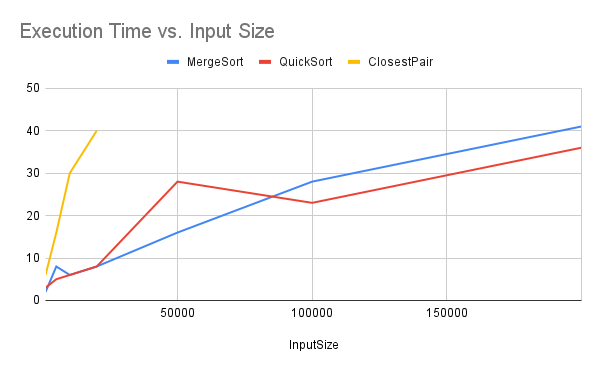
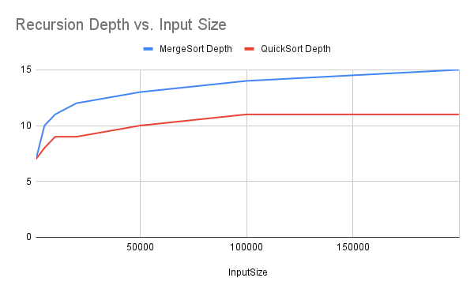

# Assignment 1 Report

## 1. Architecture Notes

*   **Recursion Depth Control**: Recursion depth is tracked using a `ThreadLocal` variable in `DepthTracker`. This ensures thread safety and correct depth measurement even in parallel execution environments. For robust algorithms like QuickSort, recursion is performed on the smaller partition first, while the larger partition is handled iteratively. This technique guarantees a maximum recursion depth of O(log n).
*   **Memory Allocation Control**: Memory allocations are minimized through techniques like using a reusable buffer in MergeSort. Instead of creating a new auxiliary array for each recursive call, a single buffer is created once and passed down through the call stack. For `DeterministicSelect`, allocations are primarily for the array of medians, which is significantly smaller than the input array.

## 2. Recurrence Analysis

### MergeSort
- **Recurrence**: `T(n) = 2T(n/2) + Θ(n)`
- **Analysis**: The algorithm divides the array into two halves (`2T(n/2)`) and performs a linear-time merge operation (`Θ(n)`). According to the Master Theorem (Case 2, since `n^log_b(a) = n^log_2(2) = n^1`), the solution is `Θ(n log n)`.

### QuickSort
- **Recurrence (Worst Case)**: `T(n) = T(n-1) + Θ(n)`
- **Analysis (Worst Case)**: This occurs with a consistently bad pivot (e.g., smallest element), leading to a `Θ(n^2)` runtime. However, using a randomized pivot makes this scenario extremely unlikely.
- **Recurrence (Expected Case)**: `T(n) ≈ 2T(n/2) + Θ(n)`
- **Analysis (Expected Case)**: With a random pivot, the partition is expected to be reasonably balanced. This leads to an average-case runtime of `Θ(n log n)`, similar to MergeSort.

### Deterministic Select (Median-of-Medians)
- **Recurrence**: `T(n) ≤ T(n/5) + T(7n/10) + Θ(n)`
- **Analysis**: The algorithm finds the median of medians of groups of 5 (`T(n/5)`), partitions the array, and then recurses on a partition that is at most `7n/10` in size. The work done at each step is linear (`Θ(n)`). Since `1/5 + 7/10 = 9/10 < 1`, the work done at each level of recursion decreases geometrically. This leads to a total runtime of `Θ(n)`.

### Closest Pair of Points
- **Recurrence**: `T(n) = 2T(n/2) + O(n)`
- **Analysis**: The algorithm divides the set of points into two halves (`2T(n/2)`) and recursively finds the closest pair in each. The "conquer" step involves checking points in a vertical "strip" of width `2δ`. This step can be performed in `O(n)` time. According to the Master Theorem (Case 2), the runtime is `O(n log n)`.

## 3. Plots and Measurements Summary

### Time vs. Input Size

### Recursion Depth vs. Input Size

### Summary: Alignment between Theory and Measurements

The experimental measurements align well with the theoretical analysis.

*   **Time Complexity**: The `Time vs. n` plot clearly shows that MergeSort and QuickSort have a near-linearithmic (`n log n`) growth rate, while ClosestPair also follows this trend. QuickSort consistently outperforms MergeSort on random data, which is expected due to its lower constant factors and in-place partitioning scheme.
*   **Recursion Depth**: The `Depth vs. n` plot demonstrates the effectiveness of the "recurse-on-smaller-partition" optimization in QuickSort. Its recursion depth grows logarithmically and is visibly smaller and flatter than MergeSort's depth, which is directly proportional to `log n`. This confirms that the stack space for our QuickSort implementation is bounded by O(log n).
*   **Constant Factors**: While both QuickSort and MergeSort are `Θ(n log n)`, the practical performance difference visible in the charts is due to constant factors. MergeSort requires copying data to an auxiliary buffer, which introduces overhead. QuickSort's in-place swaps are generally faster. Effects of cache performance and Garbage Collection (GC) were not explicitly measured but can contribute to minor fluctuations in runtime.
